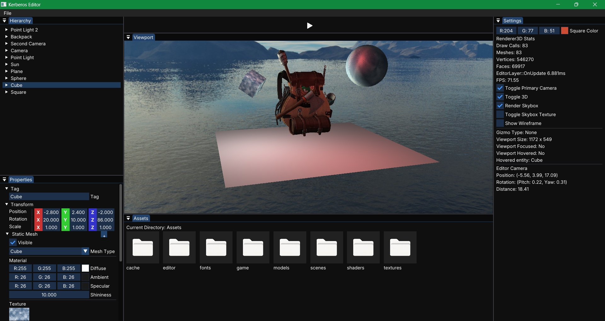

# Kerberos

3D Game Engine built with modern c++.

Supports importing textures from files, and has limited support for importing models as well.

Uses an Entity Component System, so it is really easy to add or delete components from entities, both in the Editor and from the source code.

- Has support for physics simulation, using the third-party JoltPhysics library.
- Skybox rendering can be toggled on and off, and the 2 cube textures can be changed via the UI. Any images can be used as a skybox, however they can only be loaded via c++ code for now
- Textures can be drag and dropped from the ContentBrowser to the entity's texture preview image, if the entity has a StaticMeshComponent